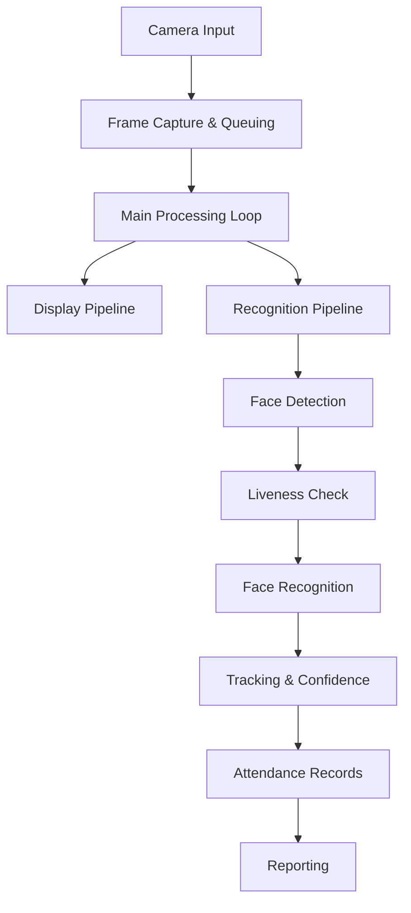

# Data Flow

This document describes how data moves through our Face Recognition Attendance System from camera input to attendance reporting. We've created this guide based on our implementation experience to help team members understand the system's runtime behavior.

## Overview

Our attendance system processes multiple video streams in real-time, detecting faces, verifying their liveness to prevent spoofing, matching them against a database of enrolled students, and maintaining attendance records. The data flow architecture balances throughput, accuracy, and resource utilization across several interconnected components.

Unlike traditional monolithic designs, we've implemented a multi-threaded pipeline approach that allows parallel processing while maintaining synchronized data access. This document walks through each stage of that pipeline, highlighting key design decisions and data handoff points.

## Key Flow Components

The simplified diagram above shows the main data pathways. We'll explore each in detail below.

## Input Processing

### Camera Capture
Each camera operates on a dedicated thread to prevent blocking the main application when frame acquisition slows. This approach has proven essential for handling multiple streams simultaneously.

The capture subsystem:
- Acquires frames continuously from each configured source (webcam, IP camera, or video file)
- Timestamps each frame for later correlation with detection results
- Places frames in thread-safe queues with bounded size limits to prevent memory overflow
- Implements double-buffering with separate grab/retrieve operations to minimize inter-frame latency

We found that maintaining small queue sizes (typically 5 frames per camera) provides enough buffering to smooth processing variations while preventing excessive memory consumption when processing falls behind during peak loads.

### Main Update Loop
The central coordinator running on the main thread orchestrates all system activities. This loop represents the heartbeat of the system, performing several critical functions:

- Retrieves new frames from each camera's queue as they become available
- Maintains the most recent frame from each camera for display purposes
- Makes intelligent decisions about which frames to submit for recognition processing
- Updates the user interface with current status information and detection results
- Schedules periodic tasks like confidence calculation and session management

A key optimization we implemented is adaptive frame skipping. Rather than processing every frame (which would waste resources for limited benefit), the system dynamically adjusts its processing rate based on current conditions:

- Under light loads, it processes most frames to maximize responsiveness
- During heavy loads or when many faces are detected, it increases the skip rate to maintain throughput
- When recognition is challenging (poor lighting, distant faces), it decreases the skip rate to improve detection chances

This adaptive approach provides a good balance between system responsiveness and efficient resource utilization across varying conditions.

## Recognition Pipeline

The heart of our system is the multi-stage recognition pipeline that turns raw video frames into identifications. This pipeline runs on worker threads from a thread pool to maximize CPU utilization without overwhelming the system.

### Preprocessing Stage
Before attempting face detection, frames undergo several preprocessing steps:
- Color space conversion from OpenCV's BGR format to RGB needed by our detection models
- Conditional enhancement based on assessed lighting conditions:
  - In low-light scenarios, we apply Contrast Limited Adaptive Histogram Equalization (CLAHE)
  - In normal lighting, we apply minimal noise reduction via Gaussian filtering
  - In challenging lighting with shadows or backlighting, we apply additional bilateral filtering
- Optional resolution reduction for large frames to improve processing speed

These preprocessing steps dramatically improve detection reliability, especially in the varied lighting conditions typical of classroom environments. We spent considerable time fine-tuning these parameters to find the right balance between enhancement and artifact introduction.

### Face Detection Stage
Once preprocessed, frames pass through our face detection pipeline:
- MTCNN processes the frame to identify potential face regions
- A confidence filtering step removes low-probability detections
- Non-Maximum Suppression resolves overlapping detections
- Size-probability product ranking prioritizes the clearest faces when too many are detected
- A soft limit caps the number of faces processed per frame (default: 15) to prevent resource exhaustion

This stage represents one of the more computationally intensive parts of our pipeline. MTCNN provides excellent detection accuracy compared to alternatives we evaluated, but at higher computational cost. We've found the tradeoff worthwhile, as missed detections cascade into recognition failures downstream.

### Liveness & Recognition Loop
For each detected face, the system performs several operations:
- Spatial tracking to associate the face with previously detected faces using Intersection over Union (IoU)
- Liveness verification to prevent spoofing attacks:
  - New faces undergo immediate liveness checks
  - Tracked faces receive periodic reverification on a scheduled basis (every ~25 frames)
  - Multiple techniques (texture analysis, eye aspect ratio, movement patterns) work together for robust spoofing detection
- Recognition processing:
  - Face regions from tracked identities use cached recognition results
  - New faces are normalized, aligned, and batched for efficient model processing

Liveness detection presented significant challenges during development. Early versions suffered from false rejections of genuine faces, especially in challenging lighting conditions. Our multi-factor approach evolved from these experiences, providing robust protection against common spoofing methods while maintaining high acceptance rates for genuine users.

### Batch Processing
Rather than processing each face individually, our system accumulates batches of face images for more efficient model inference:
- Faces are collected until either:
  - The batch reaches optimal size (typically 8 faces)
  - A timeout occurs (100ms) to prevent excessive latency
- The batch is processed through the InceptionResnetV1 model in a single forward pass
- Resulting embeddings are normalized and compared against the known face database
- A cosine similarity metric determines potential matches
- Temporal smoothing combines current matches with previous results to reduce fluctuations

This batching approach yielded substantial performance improvements compared to our initial implementation that processed faces sequentially. The throughput difference becomes especially pronounced when processing multiple video streams simultaneously.

### Results Storage
After processing, results are carefully stored in thread-safe data structures:
- Detection annotations are associated with their source camera and timestamp
- Face tracking information is updated with new positions and confidence scores
- Attendance records accumulate evidence about each student's presence
- Detection history logs support later confidence calculations

Thread safety is crucial here since multiple processing threads potentially write to these structures while the main thread reads from them for display and reporting. We implement explicit locking mechanisms to prevent race conditions that could corrupt these critical data structures.

## Confidence Calculation

A distinctive feature of our system is its temporal confidence model. Rather than making binary present/absent decisions based on single detections, we accumulate evidence over time:

- A dedicated confidence calculation runs periodically (every 3 seconds) during active sessions
- The calculation examines recent detection history across all cameras for each tracked individual
- A weighted scoring algorithm considers multiple factors:
  - Detection frequency within a sliding time window (typically 10 seconds)
  - Quality of matches based on similarity scores
  - Successful liveness verifications
  - Consistency across different camera views
  - Temporal stability of detections
- Older detections receive diminishing weight through exponential decay
- Confidence scores update in real-time as evidence accumulates
- Configurable thresholds determine when a student transitions from "Uncertain" to "Present"

This evidence-based approach has proven far more reliable than simpler methods, particularly in challenging classroom environments where students move, turn their heads, or are temporarily obscured. The system can maintain tracking through brief detection gaps, while requiring sustained evidence before confirming attendance.

## Shared Data Structures

Several key data structures form the backbone of our system's state management. These structures require careful synchronization to prevent race conditions in our multi-threaded environment:

### Display Annotations
Maps each camera index to a collection of detection results for the most recently processed frame:
- Bounding box coordinates for detected faces
- Matched identity information (or "Unknown" designation)
- Similarity scores for recognized individuals
- Liveness determination results
- Timestamp of the detection

The main thread reads these annotations to draw overlay information on displayed frames, while processing threads update them as new detections occur.

### Face Tracking
Maintains the current state of all tracked faces across frames:
- Last known position (bounding box coordinates)
- Time-to-live counters for handling temporary disappearances
- Identity association (if recognized)
- Confidence history
- Liveness status

This structure enables temporal continuity, allowing the system to maintain identity consistency even when faces temporarily disappear from view or recognition confidence fluctuates.

### Attendance Records
Serves as the authoritative record of attendance status:
- Student identification information
- Current attendance status (Present/Absent/Uncertain)
- Cumulative confidence score
- First and last detection timestamps
- Camera IDs that contributed to detection
- Session metadata

This structure evolves throughout a session, starting with all students marked "Uncertain" and progressively updating as confidence scores cross configured thresholds.

### Detection History
Tracks detection events over time to support confidence calculation:
- Timestamped detection records for each recognized individual
- Camera source information
- Similarity scores
- Liveness confirmation status

This historical record provides the raw data for our temporal confidence model, allowing evidence accumulation across multiple frames and cameras.

## Output Generation

The system produces several types of output to communicate attendance results to operators and other systems.

### Real-time Display
The graphical interface provides immediate visual feedback about system operation:
- Video displays with annotated bounding boxes highlight detected faces
- Color-coding indicates recognition status (recognized, unknown, failed liveness)
- Text overlays show identity information and confidence percentages
- Status panels display current attendance statistics
- Log displays show system events and potential issues

This real-time feedback helps operators monitor system performance and identify potential issues, such as students positioned outside camera view or lighting problems affecting recognition.

### Attendance Finalization
When an attendance session ends, the system performs several final analyses:
- A comprehensive confidence calculation examines the entire session history
- Extended liveness analysis looks for suspicious patterns that might indicate sophisticated spoofing
- Statistical outlier detection identifies potential recognition problems
- Configurable attendance policy rules are applied to determine final status
- Results are locked into the attendance database with complete evidence records

These final steps ensure that attendance determinations are robust and backed by sufficient evidence, reducing both false acceptances and false rejections.

### Reporting Options
The system provides several reporting mechanisms:
- Interactive attendance dashboard for immediate review
- Exportable Excel reports with detailed student information
- Summary text reports suitable for integration with other systems
- Optional API endpoints for direct database integration

These flexible reporting options allow the system to integrate with existing attendance management workflows and student information systems.

## Performance Considerations

Throughout development, we've identified and addressed several performance bottlenecks:

### Computation Distribution
Face detection and recognition are computationally intensive. To maintain real-time performance, we:
- Distribute processing across multiple CPU cores using a thread pool
- Leverage GPU acceleration when available for neural network inference
- Implement adaptive processing rates based on system load
- Prioritize the most promising faces when resources are constrained

### Memory Management
Video processing can consume substantial memory. We manage this through:
- Bounded queues to prevent frame buildup during processing lags
- Early downsampling of high-resolution video
- Careful reference management to allow timely garbage collection
- Region-of-interest processing to avoid unnecessary operations on entire frames

### Threading Considerations
Multi-threaded applications introduce synchronization challenges. We address these with:
- Clear ownership rules for shared data structures
- Explicit locking for critical sections
- Non-blocking operations where possible to prevent deadlocks
- Careful thread lifecycle management to prevent leaks

These optimizations have allowed our system to handle multiple camera streams on modest hardware, making it practical for deployment in typical classroom environments.

## Challenges and Solutions

During system development, we encountered and solved several significant challenges:

### Lighting Variation
Classroom lighting varies dramatically, from bright windows causing backlighting to dim corners with insufficient illumination. Our adaptive preprocessing pipeline evolved from these experiences, automatically adjusting enhancement techniques based on assessed lighting conditions.

### Spoofing Attempts
Students occasionally attempt to defeat the system using printed photos or screen displays of classmates. Our multi-factor liveness detection approach resulted from extensive testing against common spoofing techniques, providing robust protection without excessive false rejections.

### Threading Complexity
Early versions suffered from subtle threading issues, including deadlocks and race conditions. We redesigned our architecture to use a producer-consumer pattern with clear ownership boundaries, significantly improving stability.

### Performance Scaling
Initial implementations slowed dramatically when processing multiple cameras. Our batch processing approach and adaptive frame skipping emerged from performance profiling, allowing linear scaling with additional cameras up to the limits of available computing resources.

These hard-won insights have shaped the current system architecture, resulting in a robust solution that performs reliably across a wide range of deployment scenarios.
